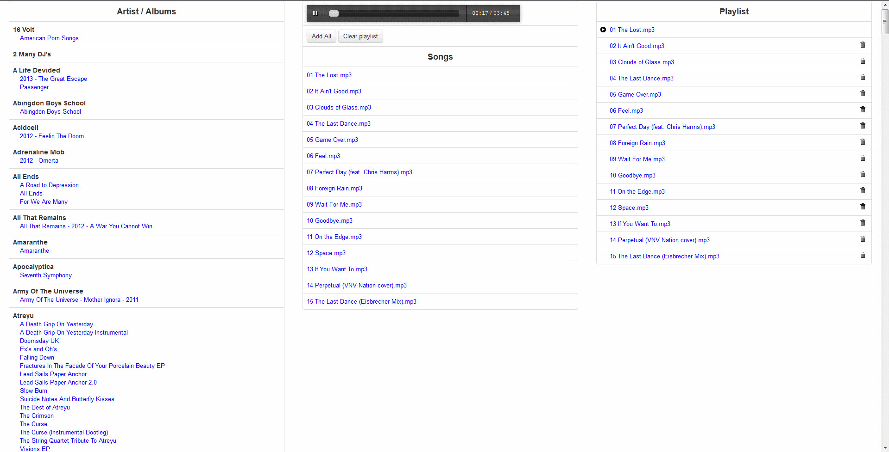

music-player
============

A very lightweight directory based music player. Listing directories( artists ) and subdirectories( albums ).

Making playlists from mp3 files in folders

### Suggested structure
    -root
    -ARTIST-1
        -Album 1
        -Album 2
    -ARTIST-2
        -Album 1
        -Album 2
    -ARTIST-N
        -Album-N
    -public ( not listed )
    -index.php

Using AngularJS for listing (http://angularjs.org/)

Bootstrap for UI (http://twitter.github.com/bootstrap/)

Audio.js ( http://kolber.github.com/audiojs/ ) 

 
 
### Screenshot

